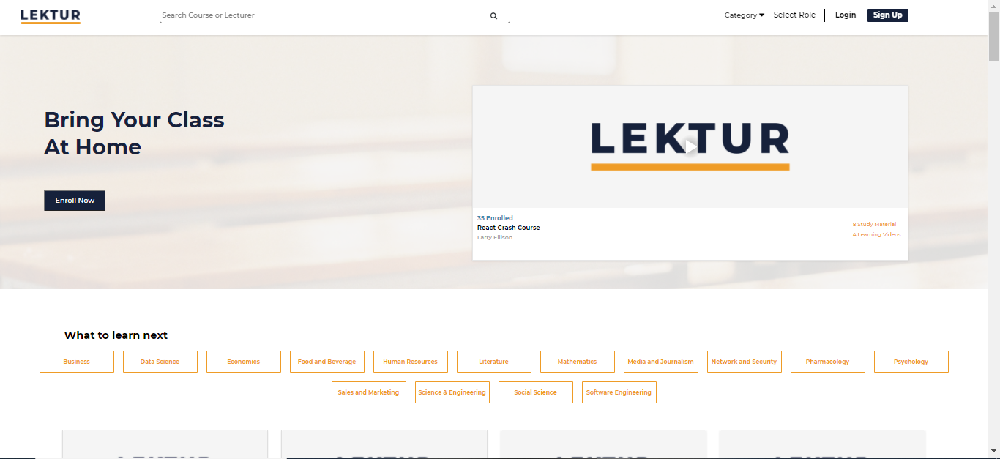
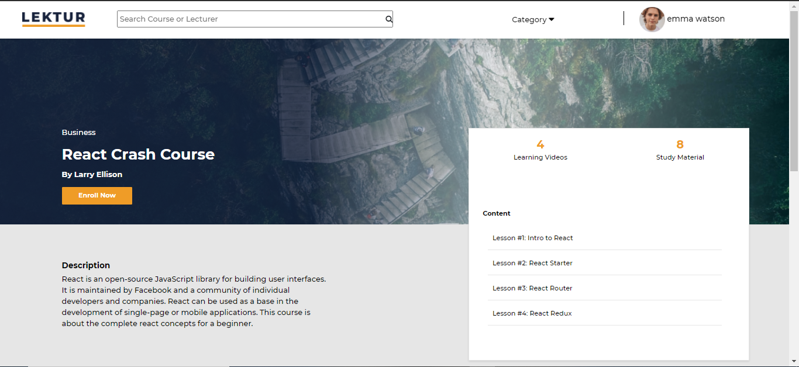
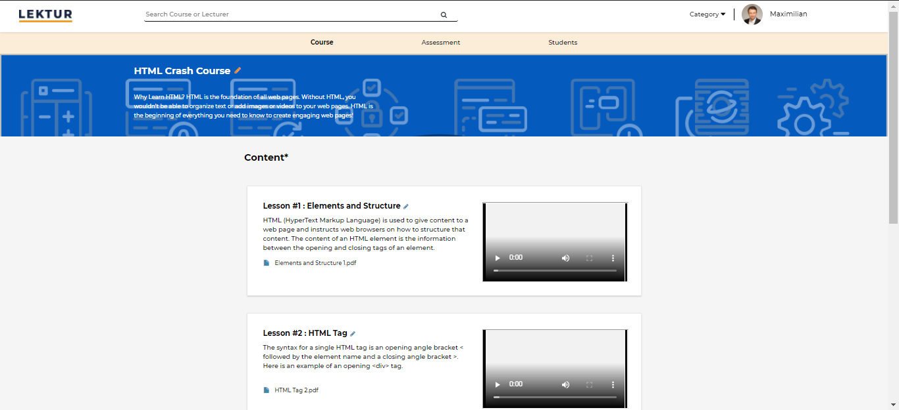
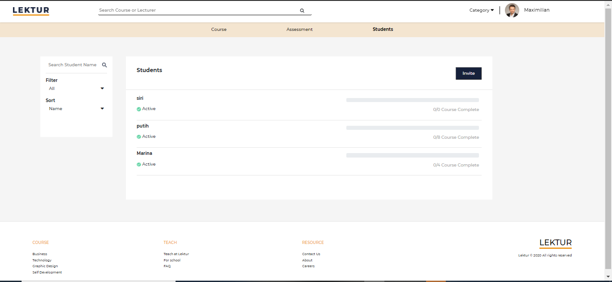

<h1 align="center">Welcome to lektur 👋</h1>

> Final Project - Lektur - Glints Academy Batch 10

## About The Project

Glints Academy Final Project.This project basically the last project that we need to complete before graduation from the bootcamp which is Glinta Academy Bootcamp batch 10, here we build an app named LEKTUR which lektur is a online platform for learning management system where users are welcome to teach and learn courses here users can register as student or teacher where for student can pick the lesson that they desire to learn and can track the progress of their study , take an assessment once completed their study and get the certificate as well. And for teachers there can create material , class , and assessment also can invite students for their material through email invitation.

<h5>Final Project Lektur Homepage</h5>

  <a href="#">
    
  </a>
<h5>Final Project Lektur Course detail once stdudent enrolled the course</h5> 
<a href="#">
    
  </a>
  <h5> Final Project Lektur Teacher dashboard material</h5>
<a href="#">
    
  </a>
<h5> Final Project Lektur Teacher dashboard for student material enrolled list</h5>
  <a href="#">
    
  </a>

### ✨ [Demo]

## Install

```sh
npm install / yarn install
```

## Usage

```sh
npm start / yarn start
```

## Run tests

```sh
npm run test
```

## Author

👤 **- Abdurrohim Ethan , Yuli Sartika, Rantika Ayuning , Viviola Maya Putri **

## Show your support

Give a ⭐️ if this project helped you!

---

_This README was generated with ❤️ by [readme-md-generator](https://github.com/kefranabg/readme-md-generator)_
